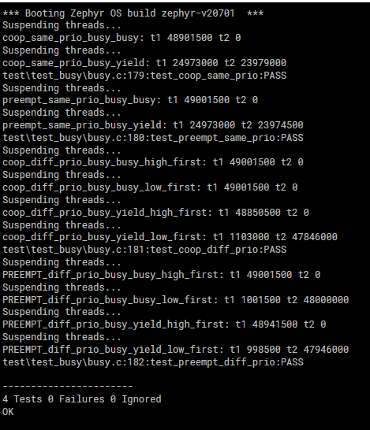

# ECE 5960 Lab 6

Activity-0: Output
--------------------------------------------

Activity-1: Predictions and Output
--------------------------------------------
For our predictions, the busy_busy function will hog the resources, and the busy_yeild runs will be more even between the two threads.

The Coop threads that are higher or the same priority will hog resources if they are run first. For one coop test, we let the lower priority run first, and it runs for a little while but then the other coop thread takes over and hogs the resources.

The Prempt threads will share resources much better. For the same priority test using busy_yield, they will be even. But for busy_buy only the first thread will run. For different priorities, and using busy_busy, the higher priority will take all the time (unless the lower priority is forced to run first). Using busy_yield, it should have the same result because in this case the higher priority is always ready.

Output description: In the test output, t1 and t2 are thread 1 and thread 2. By default, we always start thread 1 first regardless of priority (because we delay the second thread). The two times are immediatly after t1 and t2 for a single test.
   

